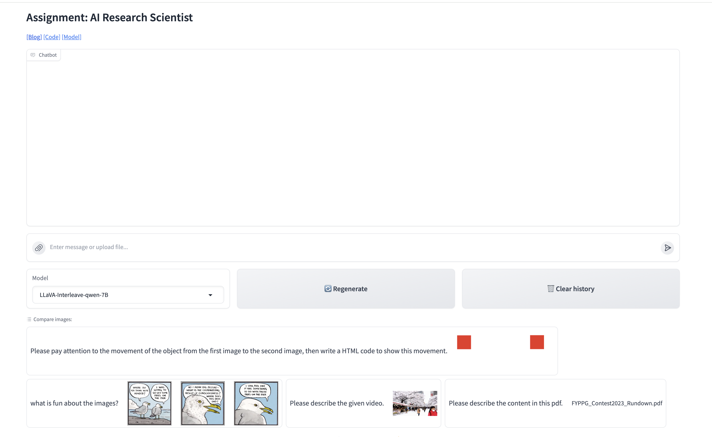

# Ailytics Assignment

## Installation
This are the environment I used. All the experiments are conducted on Linux with a single NVIDIA A30.
```bash
conda create -n ailytics_env python=3.10 -y
conda activate ailytics_env
# install the pytorch version you want
pip install torch==2.0.1 torchvision==0.15.2 torchaudio==2.0.2 --index-url https://download.pytorch.org/whl/cu118 
pip install --upgrade pip  # Enable PEP 660 support.
# the package used to process pdf files and videos
conda install -c conda-forge poppler
pip install openai moviepy pdf2image pdfminer pdfminer-six opencv-python 
# To run huggingface transformer locally
pip install -e ".[train]"
pip install flash-attn --no-build-isolation 
```


## Sample Running Script
This is the simple bash script to run the project.
- If you don't want to use the local LLM, ignore `--model_path`.
- If you don't want to use GPT, ignore `--gpt_api_key`.
- If you don't need a new endpoint for GPT, ignore `--gpt_api_base`. Since I am in Hong Kong, I cannot use the official OpenAI GPT-4o. Instead I use Azure server, which needs a new endpoint. 

```bash
# !/bin/bash
python playground/demo/interleave_demo.py \
--model_path lmms-lab/llava-next-interleave-qwen-7b \
--gpt_api_key <your-openai-key> \
--gpt_api_base <your-azure-endpoint> \
```

After you run the project, you can click the public URL in the terminal to open the UI. The UI looks like this:



You can type in the message box and upload files through the left icon of the message box. You can switch the model you use in the down drop menu on the down-left of the message box. Two models are provided in this repo. To test the model, you can simply click the examples on the bottom and then the examples are shown in the message box.

## Task 1: A chatbot 

### Open-source Materials
This repo is based on [LLaVA-NeXT](https://github.com/LLaVA-VL/LLaVA-NeXT/?tab=readme-ov-file). It provide a good UI to interacte with LLM. 

Also, it refers to the [openai codebook](https://github.com/openai/openai-cookbook)

### Base Models
I chose two LLMs as the base models. One is LLaVA-Interleave, and the other is OpenAI GPT-4o. These multi-modality LLMs supports visual inputs and the multi-image manner. Generally, the performance of close-source models like GPT-4o is better than that of open-source models. So I prefer GPT-4o in general cases. However, since finetuning is mentioned, I also include an open-source model. Though OpenAI also has a finetuning function, the whole process is ran on cloud and I personally think it might leak the data used in finetuning. Open-source models running on your own machine is more safe.


## Task 2: Two types of data format

I choose videos and pdf. These are two regular-used visual file types for humans. Also, they can be processed by GPT-4o and LLaVA-Interleave.

## Task 3: Image queries

Both GPT-4o and LLaVA-Interleave support image queries and video queries

## Task 4: Finetuning model

To finetune LLaVA model, prepare the related images and the instructions related to the images. The instructions are the task that the LLM are expected to achieve. Also, you need the ground truth output. Usually, LoRA is used in finetuning since it uses less parameters and requires less GPU resources. I wrote some sample code before (See this [link](https://huggingface.co/lyclyc52/llava_finetune/tree/main)).

To finetune GPT, please refer to [this](https://github.com/openai/openai-cookbook/tree/main/examples/fine-tuned_qa)
